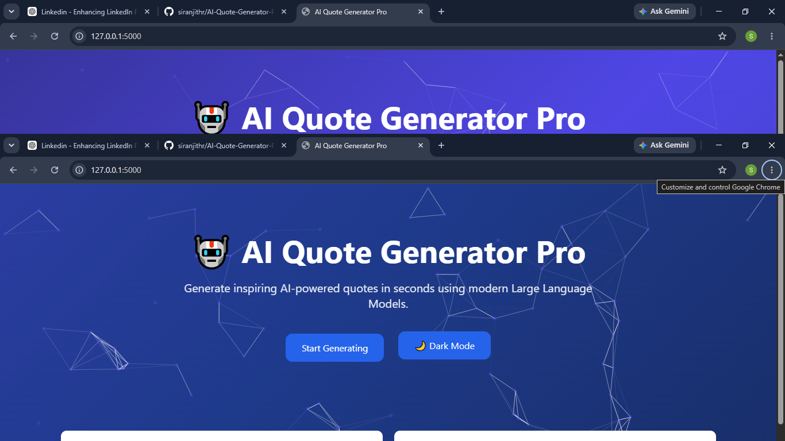
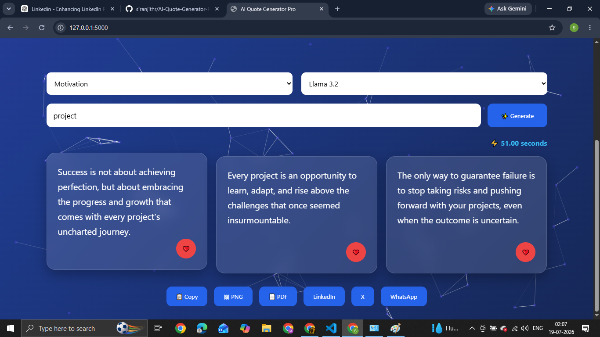
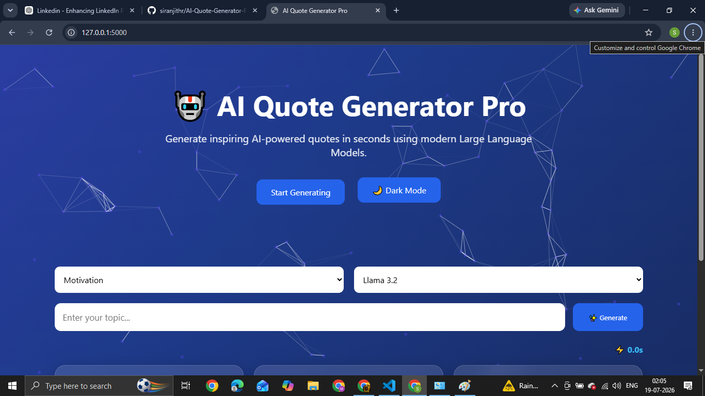
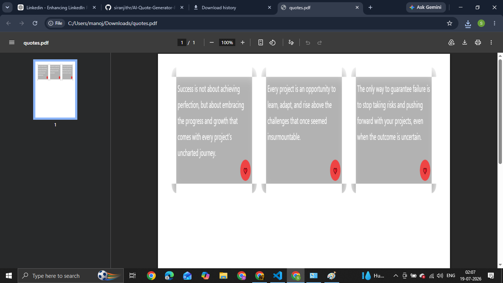

# 🤖 AI Quote Generator Pro

<p align="center">


</p>

<p align="center">

An AI-powered web application that generates inspirational quotes using Large Language Models (LLMs) running locally with **Ollama** and **Llama 3.2**.

Built using **Flask**, **Python**, **HTML**, **CSS**, and **JavaScript**.

</p>

---

# 🚀 Features

- 🤖 AI-powered quote generation
- 🧠 Local LLM integration using Ollama
- ✨ Three unique AI-generated quotes
- 📚 Multiple quote categories
- 🌙 Dark / Light Mode
- ❤️ Favorite quotes
- 📋 Copy to clipboard
- 📄 Export quotes as PDF
- 🖼 Download quotes as PNG
- 📤 Share to LinkedIn, X (Twitter), and WhatsApp
- ⚡ Response time display
- 🎨 Modern Glassmorphism UI
- 📱 Fully Responsive Design

---

# 📸 Screenshots

## 🏠 Home Page



---

## 🤖 AI Quote Generation



---

## 🌙 Dark Mode



---

## 📄 PDF Export



---

# 🏗️ Project Architecture

```text
              User
                │
                ▼
      HTML + CSS + JavaScript
                │
         Fetch API Request
                │
                ▼
            Flask Backend
             (app.py)
                │
                ▼
           Prompt Builder
             (llm.py)
                │
                ▼
      Ollama (Llama 3.2 Model)
                │
                ▼
        AI Generated Quotes
                │
                ▼
           Browser Display
```

---

# 🛠️ Tech Stack

## Frontend

- HTML5
- CSS3
- JavaScript

## Backend

- Python
- Flask

## Artificial Intelligence

- Ollama
- Llama 3.2
- Prompt Engineering

---

# 📂 Folder Structure

```text
AI-Quote-Generator-Pro/
│
├── static/
│   ├── style.css
│   └── script.js
│
├── templates/
│   └── index.html
│
├── screenshots/
│   ├── home.png
│   ├── generate.png
│   ├── darkmode.png
│   └── pdf.png
│
├── app.py
├── llm.py
├── requirements.txt
├── README.md
└── .gitignore
```

---

# ⚙️ Installation

## Clone Repository

```bash
git clone https://github.com/siranjithr/AI-Quote-Generator-Pro.git
```

---

## Move into Project

```bash
cd AI-Quote-Generator-Pro
```

---

## Create Virtual Environment

Windows

```bash
python -m venv venv
```

Activate

```bash
venv\Scripts\activate
```

---

## Install Dependencies

```bash
pip install -r requirements.txt
```

---

## Install Ollama

Download Ollama:

https://ollama.com/download

---

## Download the AI Model

```bash
ollama pull llama3.2:3b
```

---

## Start Ollama

```bash
ollama serve
```

---

## Run the Application

```bash
python app.py
```

Open:

```
http://127.0.0.1:5000
```

---

# 🎯 How It Works

1. User enters a topic.
2. Flask receives the request.
3. A prompt is created in `llm.py`.
4. Ollama processes the prompt using the Llama 3.2 model.
5. Three AI-generated quotes are returned.
6. Quotes are displayed with export and sharing options.

---

# 📈 Future Improvements

- 🔐 User Authentication
- 👤 User Dashboard
- ⭐ Cloud-synced Favorites
- 📊 Analytics Dashboard
- 🌍 Multi-language Support
- 🎙️ Voice Input
- 🔊 Text-to-Speech
- ☁️ Cloud Deployment
- 🤝 Team Collaboration

---

# 🎓 Learning Outcomes

Through this project I learned:

- Flask Web Development
- REST API Communication
- AI Model Integration
- Prompt Engineering
- Frontend–Backend Integration
- JavaScript Fetch API
- Responsive UI Design
- Git & GitHub Workflow

---

# 🤝 Contributing

Contributions are welcome.

1. Fork the repository
2. Create a feature branch
3. Commit your changes
4. Push your branch
5. Open a Pull Request

---

# 📜 License

This project is licensed under the MIT License.

---

# 👨‍💻 Author

## Siranjith R

**B.E. Computer Science & Engineering**

AI | Generative AI | Full Stack Development

GitHub:

https://github.com/siranjithr

---

## ⭐ Support

If you found this project helpful, consider giving it a ⭐ on GitHub.
